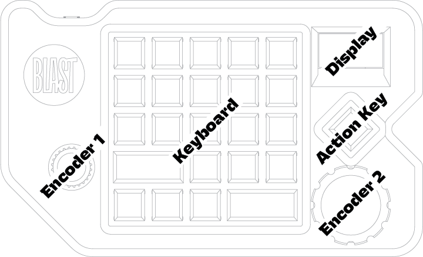
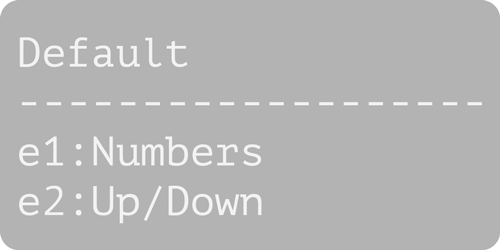
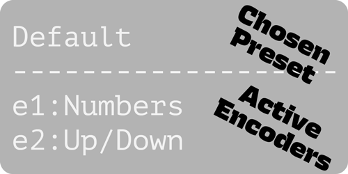
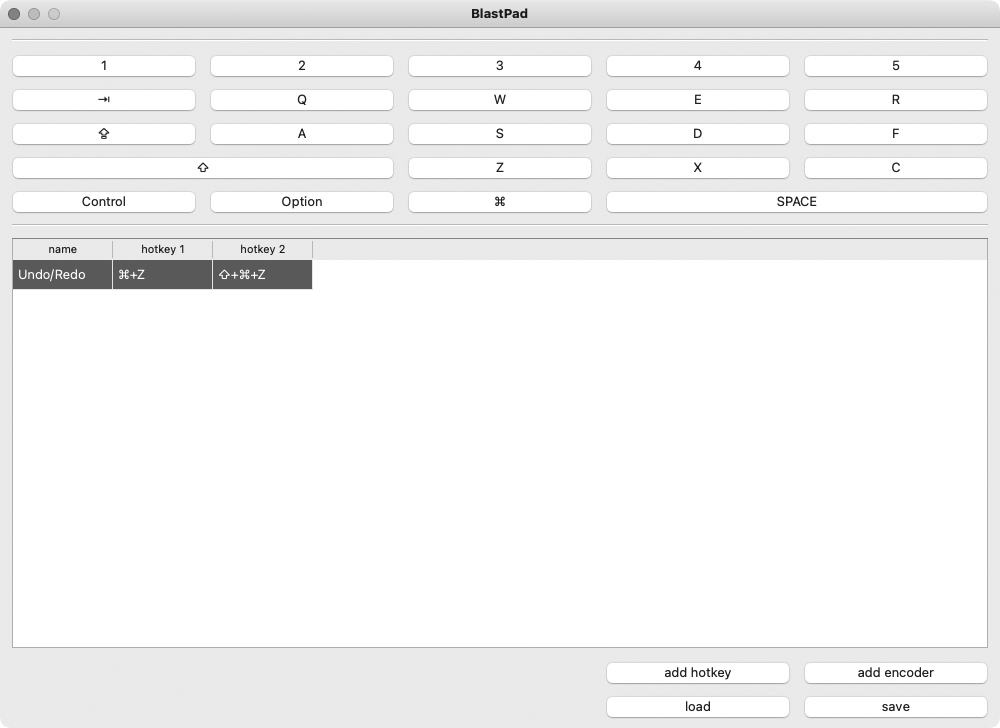
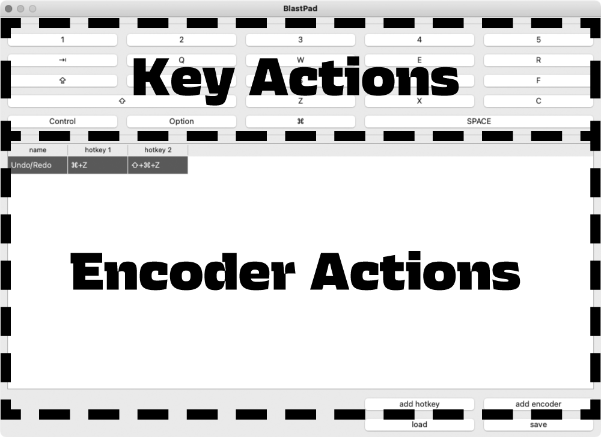
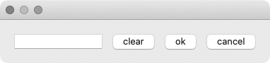

# BLASTPad Documentation

**BLASTPad** is a macropad – a programmable keyboard with 23 customazible keys and 2 encoders (knobs). 

# Instruction

## Layout

Keyborad's layout was designed to resamble the most left 5 columns of a standard keyborad with the exclusion of the top row (which usually contains all the _F_ keys together with _ESC_ key ). All of the keys are programmable, which means that with the help of a small desktop app you will be able to change behaviour of each key by assigning keystroke combinations to all of them.  Additionally **BLASTPad** has two rotary encoders, which also can trigger some keystroke actions.

## First Run

1. Connect your **BLASTPad** to your computer via USB MICRO B cable. New usb storage device called **BLASTPAD** should appear. We will talk about it more later.
2. Wait until **BLAST** logo will disappear.
3. You should see the similar data on the display:

- "Default" is a title of currently active **Preset**.
- "Numbers" is a title of an **Encoder Action** currently assigned to the **Encoder 1**
- "Up/Down" is a title of an **Encoder Action** currently assigned to the **Encoder 2**

### Encoder Basics

In next the chapter we will talk more about **Presets** and how to set them up together with the **Key and Encoder Actions**.  For now let's focus on the behaviour of the latter.

#### Changing the Encoder Actions:

Push the knob like it were a button.

You can see on the display that encoder changed it's title and therefore it changed its behaviour. Each **Preset** has its own set of "behaviours" that can be assigned to eighter **Encoder 1** or **Encoder 2** (see chapter **Creating and editing Presets** to learn how to create those behaviours).

There are two **types of Encoder Actions**:

- **"Left/Right" Encoder Action**

  >  In this action you have assigned two keystrokes to the encoder: one to the counterclockwise and the other one to the cockwise movements.
  >
  > Good example is the "Up/Down" action. Left movement performs "UP ARROW" keystroke, while right movement performs "DOWN ARROW" keystroke. Test it, for example, in some text editor. You will see that the cursor behaves in a similar way, as you would hit the arrow buttons.

- **"Carousel" Encoder Action**

  >"Numbers" is a good example of a carousel action. In this action when you rotate knob clockwise, it will execute numerical keystroke. With every step the keystroke will represent incremented digit starting from *0* (zero) until it will reach the *9*. After this, the counting will reset to *0*.
  >
  >If you'll rotate know counterclockwise, the operation will work almost the same. Except, this time instead of incrementing, it will decrement digits.

  

## Creating and editing Presets

**Preset** is a singular set of instructions, which determines what keystroke sequence will be triggered by your keys or encoders. You can store almost as many presets on your **BlastPad** as you want.

#### Maximum number of actions in the Preset:

Each **Preset** has actions assigned to the keys, which max number in the preset is equal to the number of the buttons in **BLASTPad**'s keyboard layout (23 – excluding the special lonely key on the right side of the device). Besides **Key Actions**, each preset can have **Encoder Actions**. Number of those is in theory limitless. You can switch between all of **Preset**'s **Encoder Actions** with just two physical encoders. 

#### BlastPadControl app

### MacOS

>  (Currently alpha pre-release version.)

#### Opening the app

Download the zip file from this site:

https://github.com/RafalBuchner/blastpad/releases/download/v0.0.0.1-alpha/BlastPadControl.macOS.zip

Or go to the main GitHub page of this project (https://github.com/RafalBuchner/blastpad) and look for the link in the download section of the documentation. 

Inside the unzipped folder you will find BlastPadControl executable file. Double click on it. The window like one below should appear:

This is the **Preset** Editor. It is divided into two sections. One is responsible for controling the **Key Actions**. The other one for creating and editing the **Encoder Actions**.

### Key Actions Section

**The Key Actions Section**'s buttons recreates the **BlastPad**'s keyboard layout. If you click on the one of the buttons, the popup window will appear.

In this window you can assign pressed keystroke sequence to the previously selected button on the **Key Action Section**. 

Simply press some keystroke sequence on your everyday-regular-keyboard and press "ok" button (**IMPORTANT**: Pacience, This keystroke won't be triggered by the corresponding key on the **BLASTPad** device yet – we will talk about saving presets onto the device soon).

This way you can edit all of the buttons on the **Key Action Section** layout. It is super easy.

### Encoder Actions Section

**Encoder Actions Section** is a list, where each row represent different **Encoder Actions**. Each column cell (except the one reserved for the name) defines Keystroke/Hotkey.

- To create a new **Encoder Action** hit *"add encoder"* button. It will create a new row. 

- Double click on the cell with the title "new encoder" to set the **Encoder Action**'s name that will appear on the **BLASTPad**'s display.

- Click on one of the hotkey cells to assign keystroke sequence.

### Creating "Left/Right" Encoder Action

To create a **"Left/Right" Encoder Action** you have to assign 2 hotkeys to the encoder. One in the column "hotkey 1" and the otherone in the column "hotkey 2". 

The first one will be triggered when you rotate physical encoder counterclockwise. The second, whenever you rotate the same encoder in clockwise direction.

### Creating "Carousel" Encoder Action

To create a **"Carousel" Encoder Action** you have to assign any number of hotkeys, except 2.

If you want to have additional hotkey slots created, hit *"add hotkey"* button. You can add as many as you want.

### Saving presets onto the device

You save **Presets** as separate files with **.json* extension. 

Press *Save* button to create a **Preset** file. In order to save preset on your **BLASTPad** find the usb device with the same name and save the **Preset** into *"Configs"* folder. The name of the file will be used as a **Preset Title** on the **BlastPad**'s display, so name it accordingly to your needs.

### Changing the active Presets on the BlastPad device.

If you have more than one **Presets** you will be able to swich between the presets whenever you like!

It is super easy. Hold **Action Key** (the lonley key on the right side of the device). You will enter the **Preset Selection** menu. Now, rotate your **Encoder 1** while holding the key. This way you will switch between the **Presets**.

### Windows 

> (It is currently under construction. Beta version is coming very soon.)

# Downloads

## BlastPadControl

### [MacOS Download link](https://github.com/RafalBuchner/blastpad/releases/download/v0.0.0.1-alpha/BlastPadControl.macOS.zip)

## Photos

